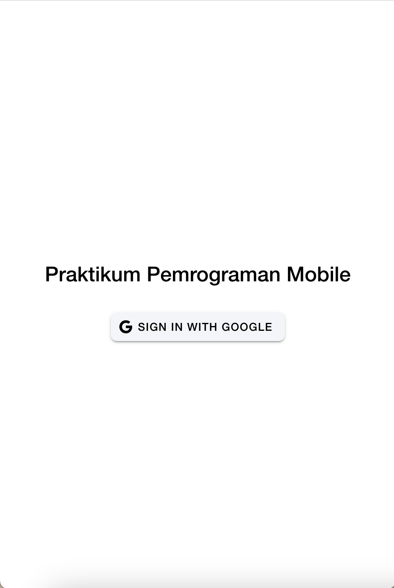
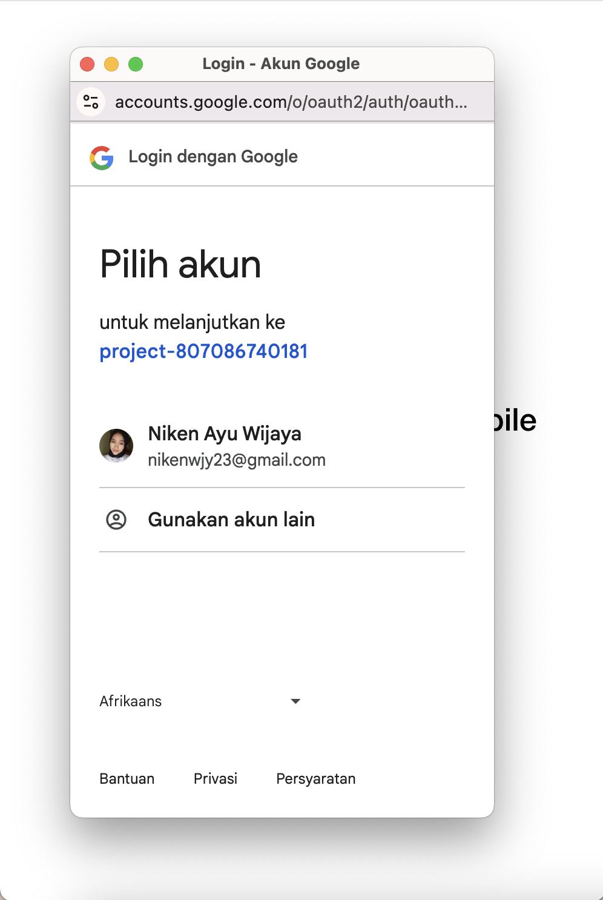
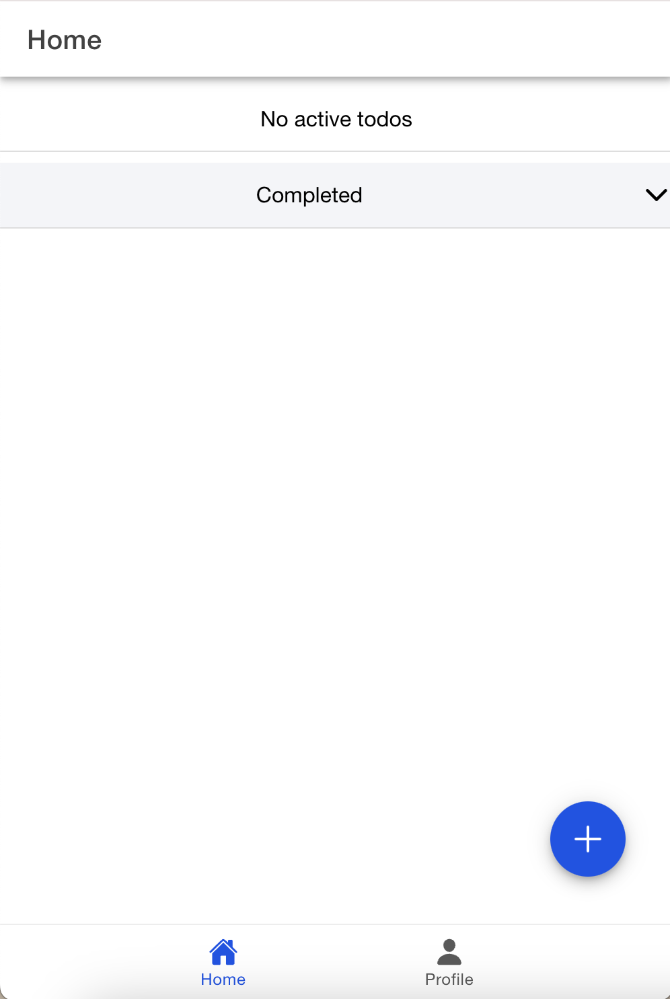

## Pertemuan 10
1. Halaman Login

   
   
3. Halaman Home
   
   
5. Halaman Profile
   
   

## Pertemuan 11
1. Halaman Login
   
   
   
3. Halaman Home
   
   
5. Add To Do
   
   
   
7. Edit To Do
   
   
   
9. Completed To Do
    
    
11. Delete
    
    
    

13. Halaman Profile

    
15. Logout

    
    
