## Pertemuan 10
1. Halaman Login
   
   Pada halaman ini akan dilakukan login menggunakan akun Google. Ketika tombol ini diklik, aplikasi akan memanggil fungsi loginWithGoogle() yang ada pada store authStore.
   
   
   
3. Halaman Home

   Halaman home berfungsi sebagai tempat untuk menampilkan menu tab. Komponen TabsMenu diimpor dari folder components dan akan menampilkan berbagai dua navigasi, yaitu Home dan Profile.

   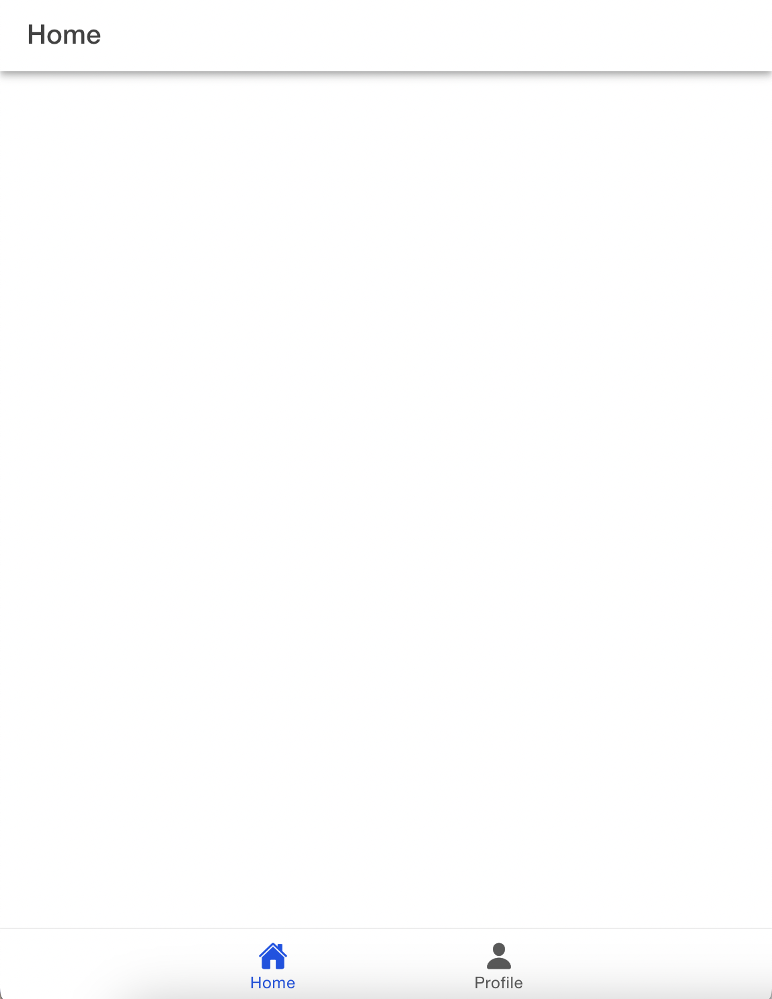
5. Halaman Profile

   Halaman Profile ini menampilkan informasi pengguna seperti foto profil, nama, dan email yang diambil dari data autentikasi. Di bagian atas, terdapat tombol Logout dan akan mengarahkan kembali ke halaman login. Foto profil pengguna ditampilkan dan data nama dan email ditampilkan dengan bersifat readonly. 

   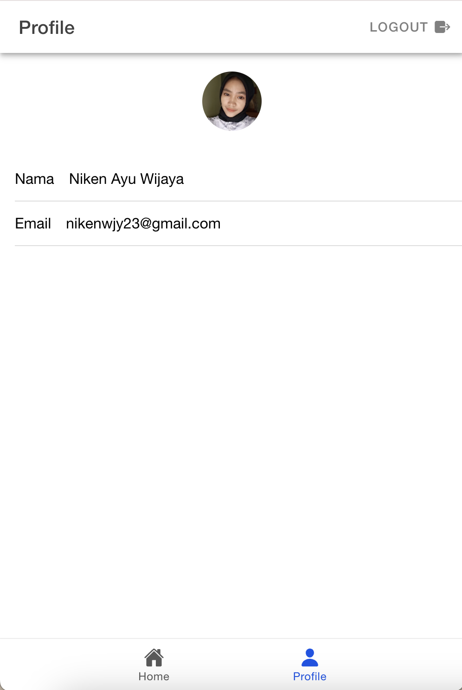

## Pertemuan 11
1. Halaman Login

   Pada halaman ini akan dilakukan login menggunakan akun Google. Ketika tombol ini diklik, aplikasi akan memanggil fungsi loginWithGoogle() yang ada pada store authStore.

   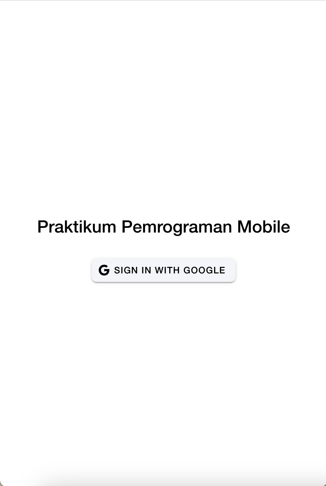
   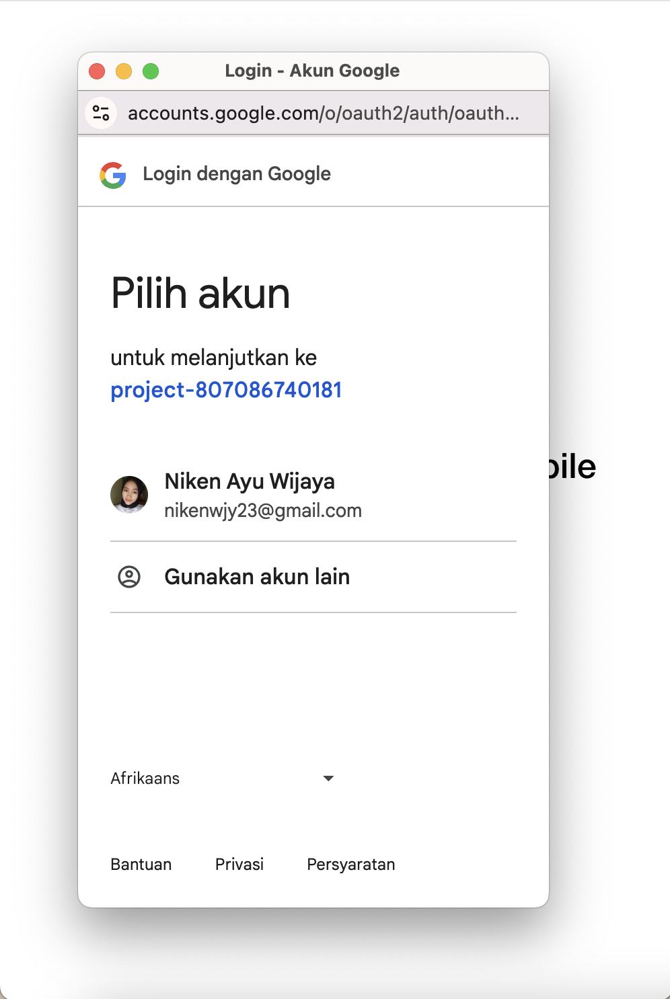
3. Halaman Home

   Halaman ini adalah halaman yang pertama muncul setelah pengguna melakukan login. Dan menampilkan Todo apabila terdapat todo yang sudah ditambahkan. Jika belum ada, terdapat keterangan "No active todos"

   
5. Add To Do

   Pada halaman Add Todo, pengguna dapat menambahkan todo baru. Pengguna dapat memasukkan judul dan deskripsi todo. Setelah itu dapat menyimpannya.
   
   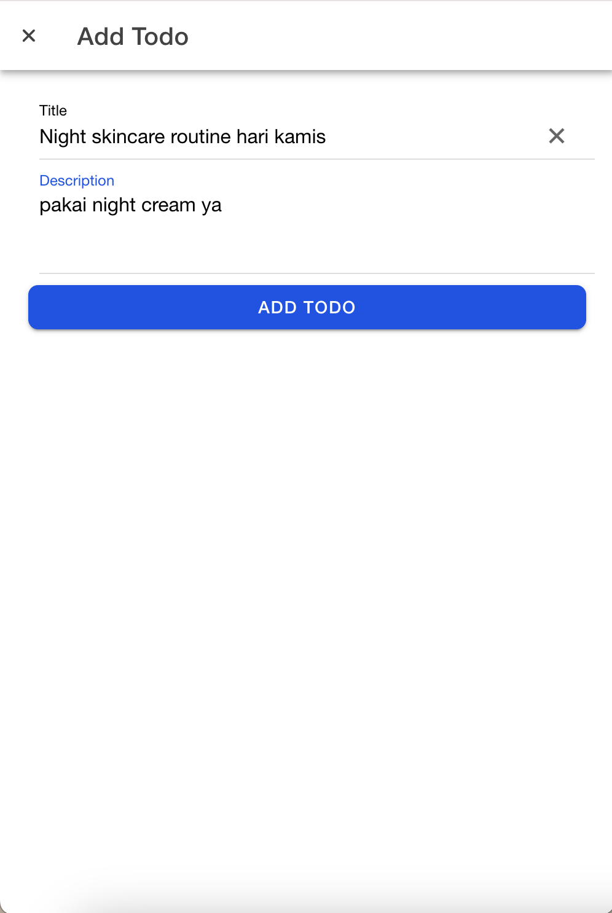
   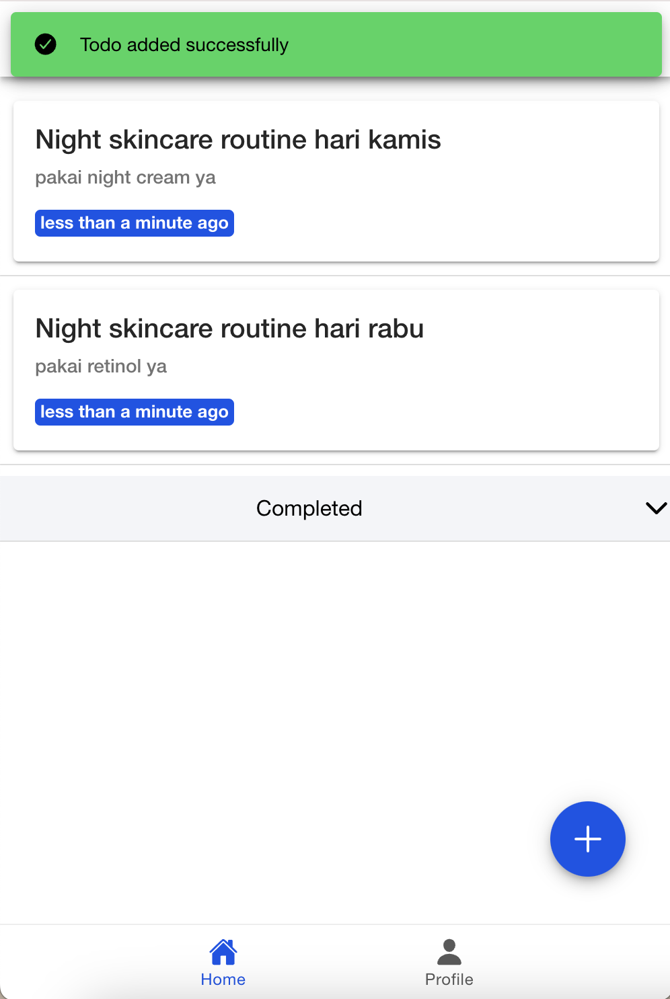
7. Edit To Do

   Saat pengguna melakukan swipe pada Todo, opsi edit muncul di sisi kanan. Pada halaman Edit, dapat diubah detail Todo yang sudah ada. Pengguna dapat mengubah judul dan deskripsi todo, lalu menyimpan perubahan edit todo

   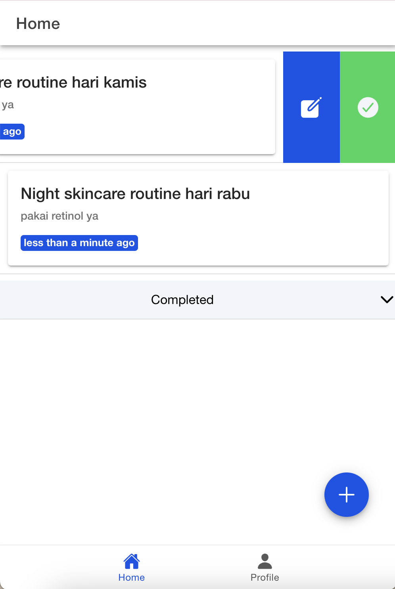
   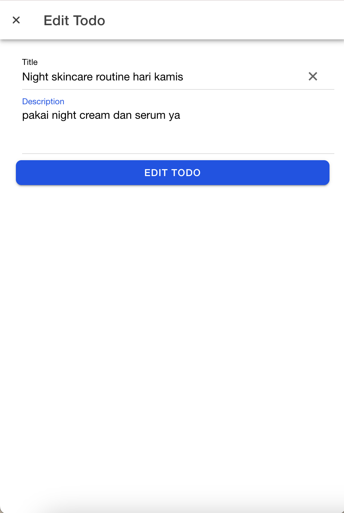
9. Completed To Do

   Pada halaman Completed Todos, ditampilkan halaman yang sudah diselesaikan yang sebelumnya. Setiap tugas dengan status "completed" akan muncul di dalam bagian ini dan dapat dilihat pula mengenai judul, deskripsi, dan waktu pembaruan todo yang sudah selesai. Selain itu, ada opsi untuk mengubah status todo kembali menjadi aktif jika diperlukan. Jika tidak ada tugas yang selesai, akan muncul pesan "No completed todos". 
    
   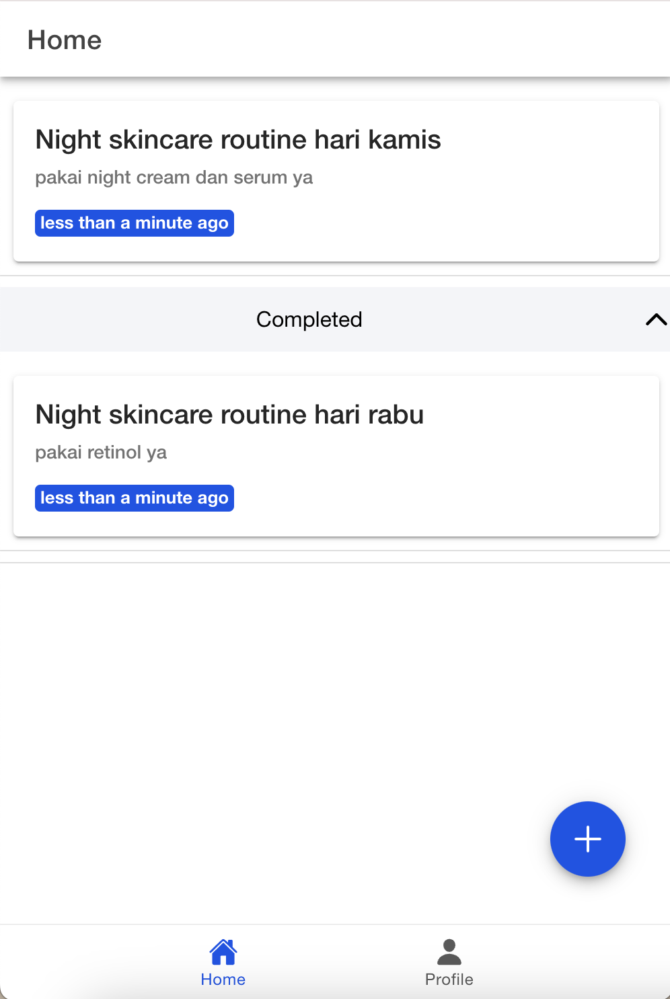
11. Delete

    Saat pengguna melakukan swipe pada Todo, opsi delete muncul di sisi kiri. Ketika opsi ini dipilih, fungsi handleDelete akan dipanggil untuk menghapus tugas tersebut dari database Firestore.
    
    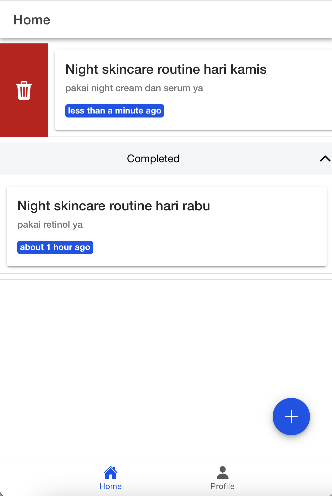
    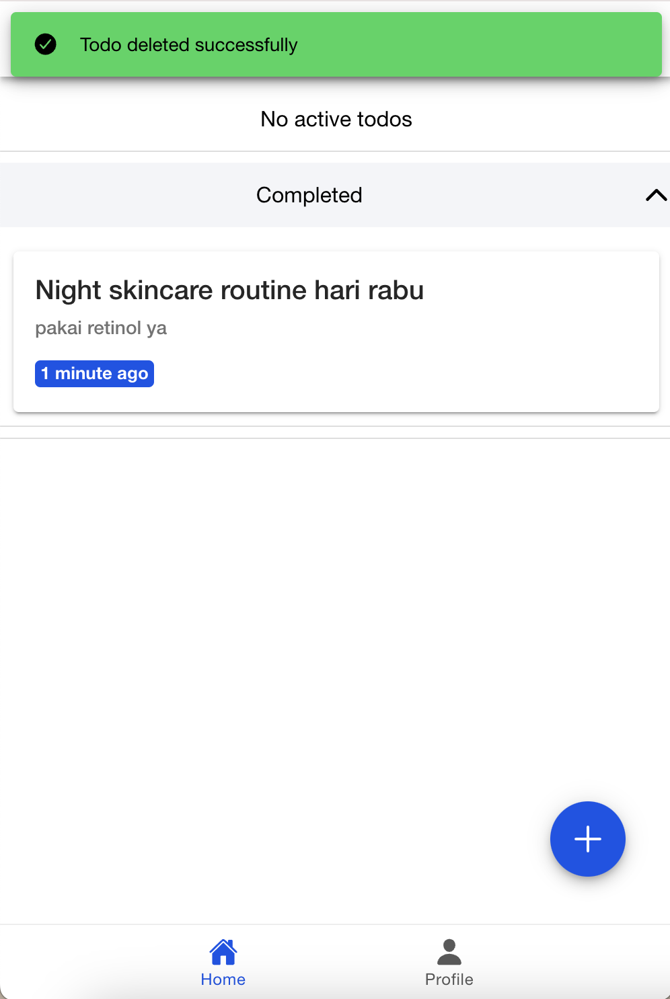

13. Halaman Profile

    Halaman Profile ini menampilkan informasi pengguna seperti foto profil, nama, dan email yang diambil dari data autentikasi. Foto profil pengguna ditampilkan dan data nama dan email ditampilkan dengan bersifat readonly. 

    
15. Logout
   Di bagian atas, terdapat tombol Logout dan akan mengarahkan kembali ke halaman login.

    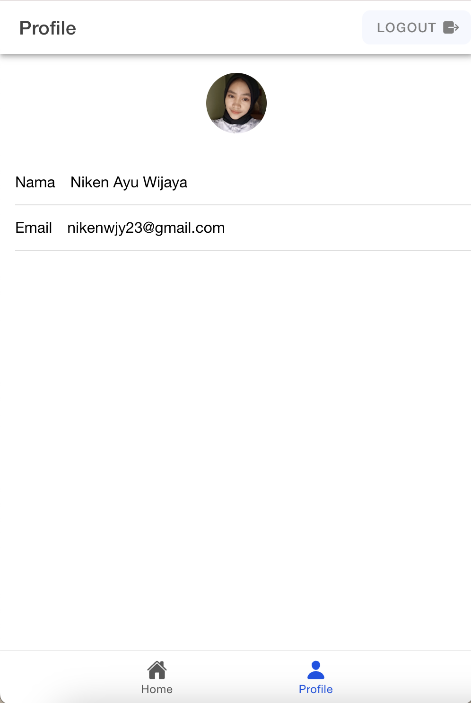
    
